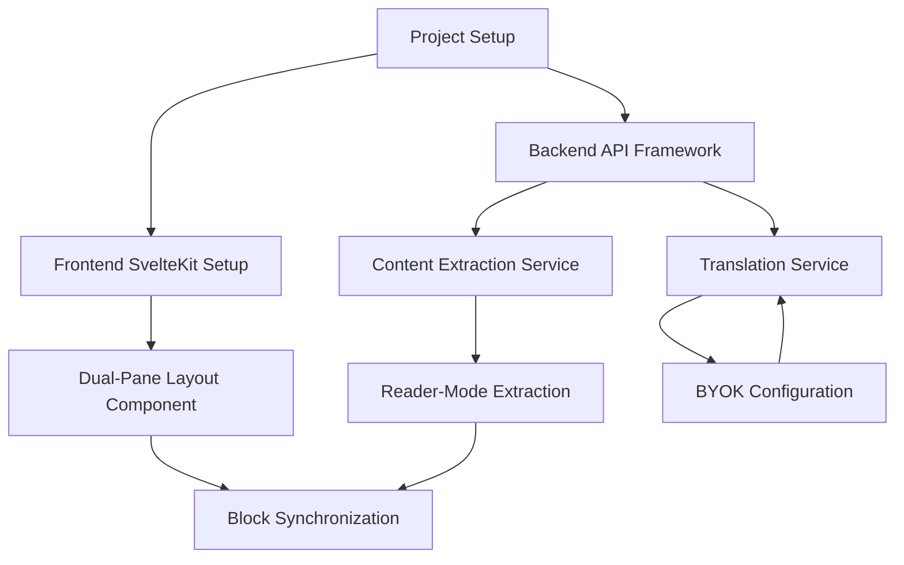

<!-- mdformat-toc start --slug=github --maxlevel=3 --minlevel=1 -->

- [Methodology: Converting Feature Specifications into GitHub Copilot-Ready Issues](#methodology-converting-feature-specifications-into-github-copilot-ready-issues)
  - [Overview](#overview)
  - [Phase 1: Pre-Issue Planning](#phase-1-pre-issue-planning)
    - [Step 1.1: Analyze Feature Dependencies](#step-11-analyze-feature-dependencies)
    - [Step 1.2: Identify Infrastructure Requirements](#step-12-identify-infrastructure-requirements)
    - [Step 1.3: Create Architecture Decision Records (ADRs)](#step-13-create-architecture-decision-records-adrs)
  - [Phase 2: Feature Decomposition](#phase-2-feature-decomposition)
    - [Step 2.1: Extract Atomic Features](#step-21-extract-atomic-features)
    - [Step 2.2: Map Features to Tech Stack Layers](#step-22-map-features-to-tech-stack-layers)
    - [Step 2.3: Define Implementation Sequence](#step-23-define-implementation-sequence)
  - [Phase 3: Issue Template Creation](#phase-3-issue-template-creation)
    - [Step 3.1: Create Issue Templates](#step-31-create-issue-templates)
    - [Step 3.2: Define Labels and Milestones](#step-32-define-labels-and-milestones)
  - [Phase 4: Individual Issue Creation](#phase-4-individual-issue-creation)
    - [Step 4.1: Write Context Section](#step-41-write-context-section)
    - [Step 4.2: Write Change Request Section](#step-42-write-change-request-section)
    - [Step 4.3: Write Acceptance Criteria](#step-43-write-acceptance-criteria)
    - [Step 4.4: Specify Files to Modify](#step-44-specify-files-to-modify)
    - [Step 4.5: Define Boundaries](#step-45-define-boundaries)
    - [Step 4.6: Add Testing Instructions](#step-46-add-testing-instructions)
    - [Step 4.7: Include Code Examples](#step-47-include-code-examples)
  - [Phase 5: Quality Assurance](#phase-5-quality-assurance)
    - [Step 5.1: Review for Copilot Compatibility](#step-51-review-for-copilot-compatibility)
    - [Step 5.2: Test with Small Issues First](#step-52-test-with-small-issues-first)
  - [Appendix A: Feature Spec → Issue Conversion Examples](#appendix-a-feature-spec-%E2%86%92-issue-conversion-examples)
    - [Example 1: Phase 1, Feature 1 - Dual-Pane Layout](#example-1-phase-1-feature-1---dual-pane-layout)
  - [Context](#context)
  - [Change Request](#change-request)
  - [Acceptance Criteria](#acceptance-criteria)
  - [Files to Modify](#files-to-modify)
  - [Do Not Change](#do-not-change)
  - [How to Test](#how-to-test)
  - [Code Example](#code-example)
  - [Code Example](#code-example-1)
    - [Example 2: Phase 1, Feature 2 - Reader-Mode Extraction](#example-2-phase-1-feature-2---reader-mode-extraction)
  - [Code Example](#code-example-2)
  - [Appendix B: Issue Size Guidelines](#appendix-b-issue-size-guidelines)
  - [Appendix C: Complete Issue Template](#appendix-c-complete-issue-template)
  - [Appendix D: Dependency Tracking](#appendix-d-dependency-tracking)

<!-- mdformat-toc end -->

# Methodology: Converting Feature Specifications into GitHub Copilot-Ready Issues<a name="methodology-converting-feature-specifications-into-github-copilot-ready-issues"></a>

______________________________________________________________________

## Overview<a name="overview"></a>

This document provides a systematic methodology for transforming the high-level
feature specifications in [feature-specifications.md](feature-specifications.md)
into actionable GitHub issues that GitHub Copilot Code Agent can execute
autonomously.

**Key Principles:**

1. **One issue = one logical, testable change** (15-30 min review time)
1. **Explicit over implicit** - spell out files, commands, and expectations
1. **Bottom-up dependency ordering** - foundation before features
1. **Copilot-first language** - write as if briefing a skilled contractor

______________________________________________________________________

## Phase 1: Pre-Issue Planning<a name="phase-1-pre-issue-planning"></a>

Before creating individual issues, establish the architectural foundation and
dependency graph.

### Step 1.1: Analyze Feature Dependencies<a name="step-11-analyze-feature-dependencies"></a>

**Action:** Create a dependency graph for features in each phase.

**Example for Phase 1:**



**Deliverable:** A visual or text-based dependency map showing which issues must
be completed before others can start.

**Tool:** Use Mermaid diagrams, issue task lists, or GitHub Projects with

**Status:** ✅ **COMPLETED** - See
[feature-dependency-analysis.md](feature-dependency-analysis.md) with
comprehensive dependency graphs for all 3 phases.

### Step 1.2: Identify Infrastructure Requirements<a name="step-12-identify-infrastructure-requirements"></a>

**Action:** List all infrastructure/setup work that must happen before feature
implementation.

**Categories:**

- **Backend setup:**
  - FastAPI project structure
  - Database models (if using persistent storage)
  - Environment configuration (.env handling)
  - Logging and error handling patterns
- **Frontend setup:**
  - SvelteKit project structure
  - State management (stores)
  - API client configuration
  - UI component library
- **DevOps:**
  - Docker containers for local development
  - CI/CD pipelines
  - Pre-commit hooks (black, ruff, mypy, prettier, eslint)

**Deliverable:** A prioritized list of "infrastructure issues" that become the
first batch of work.

**Status:** ✅ **COMPLETED** - See
[infrastructure-requirements.md](infrastructure-requirements.md) for full
details.

### Step 1.3: Create Architecture Decision Records (ADRs)<a name="step-13-create-architecture-decision-records-adrs"></a>

**Action:** Write ADRs for key architectural choices so Copilot doesn't have to
infer them.

**Example ADR Topics:**

- How we structure API endpoints (REST conventions, versioning)
- How we handle streaming translations (WebSockets vs. Server-Sent Events)
- How we store local history (IndexedDB schema)
- Error handling patterns (custom exceptions, error codes)
- Frontend state management (stores vs. props)

**Format:**

```markdown
# ADR-001: API Endpoint Structure

## Status: Accepted

## Context

We need consistent URL patterns for translation, extraction, and configuration
endpoints.

## Decision

- Use `/api/v1/` prefix for all endpoints
- Resource-based naming: `/api/v1/translations`, `/api/v1/extractions`
- POST for creation, GET for retrieval, PUT for updates

## Consequences

- Easy to version API in future
- Clear separation from frontend routes
- Copilot can follow pattern when adding new endpoints
```

**Deliverable:** 3-5 ADRs covering the most important architectural patterns.

**Status:** ✅ **COMPLETED** - See [adr/](adr/) directory with 5 ADRs:

- [ADR-001: API Endpoint Structure](adr/001-api-endpoint-structure.md)
- [ADR-002: Streaming Translation Architecture](adr/002-streaming-translation-architecture.md)
- [ADR-003: Client-Side Storage Strategy](adr/003-client-side-storage-strategy.md)
- [ADR-004: Error Handling Patterns](adr/004-error-handling-patterns.md)
- [ADR-005: Frontend State Management](adr/005-frontend-state-management.md)

______________________________________________________________________

## Phase 2: Feature Decomposition<a name="phase-2-feature-decomposition"></a>

Break down each feature specification into atomic, independently testable units.

### Step 2.1: Extract Atomic Features<a name="step-21-extract-atomic-features"></a>

✅ **COMPLETED** - See [atomic-features.md](atomic-features.md)

**Action:** For each feature in the spec, identify the smallest independently
valuable changes.

**Example: Feature 1 - Dual-Pane Translation**

The spec describes:

- Two-pane layout
- Progressive block-level rendering
- Responsive pane sizing

**Decomposition:**

1. **Backend:**
   - API endpoint to accept URL and return extracted content
   - API endpoint to translate content blocks
   - Streaming response for progressive rendering
1. **Frontend:**
   - Basic two-column layout component
   - Left pane: display extracted content
   - Right pane: display translated content
   - Draggable divider for pane resizing
   - Skeleton loaders for pending translations
   - Mobile responsive stacking

**Atomic Issues:**

- Issue #1: Create FastAPI project with basic health check endpoint
- Issue #2: Add content extraction endpoint `/api/v1/extract`
- Issue #3: Add translation endpoint `/api/v1/translate`
- Issue #4: Implement streaming translation responses
- Issue #5: Create SvelteKit dual-pane layout component
- Issue #6: Add draggable divider to adjust pane widths
- Issue #7: Add skeleton loading states
- Issue #8: Implement mobile responsive layout (stacked panes)

**Rule of Thumb:** If a feature has sub-bullets in the spec, each sub-bullet
likely becomes 1-3 issues.

### Step 2.2: Map Features to Tech Stack Layers<a name="step-22-map-features-to-tech-stack-layers"></a>

✅ **COMPLETED** - See [layer-mapping.md](layer-mapping.md)

**Action:** Organize issues by layer: Backend, Frontend, Infrastructure,
Testing, Documentation.

**Template:**

| Feature                | Backend Issues | Frontend Issues | Infra Issues | Test Issues | Doc Issues |
| ---------------------- | -------------- | --------------- | ------------ | ----------- | ---------- |
| Dual-Pane Layout       | #2, #3, #4     | #5, #6, #7, #8  | #1           | #9          | #10        |
| Reader-Mode Extraction | #11, #12       | #13             | -            | #14         | #15        |
| BYOK Configuration     | #16, #17       | #18, #19        | -            | #20         | #21        |
| Block Synchronization  | #22            | #23, #24        | -            | #25         | #26        |
| Error Handling         | #27, #28       | #29, #30        | -            | #31         | #32        |

**Deliverable:** A spreadsheet or markdown table mapping features to issues
across layers.

### Step 2.3: Define Implementation Sequence<a name="step-23-define-implementation-sequence"></a>

✅ **COMPLETED** - See [implementation-sequence.md](implementation-sequence.md)

**Action:** Number issues in dependency order (what must be done first).

**Sequencing Strategy:**

1. **Batch 1: Foundation** - Project setup, basic structure, CI
1. **Batch 2: Core Services** - Content extraction, translation API
1. **Batch 3: UI Components** - Layout, panes, basic interaction
1. **Batch 4: Integration** - Connect frontend to backend
1. **Batch 5: Polish** - Error handling, loading states, responsive design
1. **Batch 6: Testing & Documentation** - Unit tests, integration tests, docs

**Tool:** Use GitHub milestones or project boards to organize batches.

______________________________________________________________________

## Phase 3: Issue Template Creation<a name="phase-3-issue-template-creation"></a>

### Step 3.1: Create Issue Templates<a name="step-31-create-issue-templates"></a>

**Action:** Define reusable templates for different issue types.

**Template Types:**

1. **Backend Feature** - API endpoint, service, or model
1. **Frontend Component** - UI component or page
1. **Integration** - Connecting backend to frontend
1. **Testing** - Unit or integration tests
1. **Documentation** - API docs, architecture docs, user guides
1. **Infrastructure** - CI/CD, Docker, deployment

**GitHub Template Location:** `.github/ISSUE_TEMPLATE/`

**Example Template:** See [Appendix C](#appendix-c-complete-issue-template)

### Step 3.2: Define Labels and Milestones<a name="step-32-define-labels-and-milestones"></a>

**Labels:**

- `phase-1`, `phase-2`, `phase-3` - Feature phase
- `backend`, `frontend`, `infra`, `testing`, `docs` - Layer
- `copilot-ready` - Issue is ready for Copilot assignment
- `copilot-needs-review` - Copilot completed, needs human review
- `size-small`, `size-medium`, `size-large` - Effort estimate
- `dependency-blocked` - Waiting on another issue

**Milestones:**

- `Phase 1: Core Translation Workbench`
- `Phase 2: Enhanced Translation`
- `Phase 3: AI Insights & Verification`

______________________________________________________________________

## Phase 4: Individual Issue Creation<a name="phase-4-individual-issue-creation"></a>

For each atomic feature from Phase 2, create a detailed issue using the
template.

### Step 4.1: Write Context Section<a name="step-41-write-context-section"></a>

**Purpose:** Explain why this change matters and how it fits into the bigger
picture.

**Good Context:**

```markdown
## Context

This endpoint will extract clean, readable content from web pages using
Mozilla's Readability library. It's the first step in the translation
workflow - users paste a URL, this endpoint returns structured content (title,
paragraphs, images), which then gets sent to the translation service.

This is a Phase 1 feature and unblocks the dual-pane UI (Issue #5) and
translation service (Issue #3).
```

**Bad Context:**

```markdown
## Context

We need to extract content from URLs.
```

**Elements to Include:**

- What this feature does in user-facing terms
- Where it fits in the overall architecture
- What it unblocks or depends on

### Step 4.2: Write Change Request Section<a name="step-42-write-change-request-section"></a>

**Purpose:** State exactly what should change.

**Good Change Request:**

```markdown
## Change Request

Add a new POST endpoint `/api/v1/extract` that:

1. Accepts a JSON payload with a `url` field
2. Fetches the URL content
3. Uses Mozilla Readability to extract clean content
4. Returns structured JSON with: `title`, `author`, `published_date`,
   `content_blocks` (array of {type, text, metadata})
5. Handles errors gracefully (invalid URL, unreachable host, extraction
   failure)
```

**Bad Change Request:**

```markdown
## Change Request

Implement content extraction.
```

**Elements to Include:**

- Specific endpoint/component/function name
- Input/output format
- Error cases to handle

### Step 4.3: Write Acceptance Criteria<a name="step-43-write-acceptance-criteria"></a>

**Purpose:** Define testable conditions for completion.

**Format:** Use checkboxes for clarity.

**Good Acceptance Criteria:**

```markdown
## Acceptance Criteria

- [ ] Endpoint exists at `POST /api/v1/extract`
- [ ] Accepts JSON: `{"url": "https://example.com/article"}`
- [ ] Returns 200 with structured content for valid URLs
- [ ] Returns 400 for invalid URL format
- [ ] Returns 502 for unreachable hosts
- [ ] Returns 422 if extraction yields no content
- [ ] Response includes: `title`, `author`, `published_date`,
      `content_blocks`
- [ ] `content_blocks` is array of objects with `type` (paragraph, heading,
      list, etc.)
- [ ] Unit tests cover all error cases
- [ ] API documentation updated in `docs/API.md`
- [ ] Run `pytest tests/api/test_extract.py` passes
```

**Elements to Include:**

- API contract (endpoint, methods, payloads)
- Success and error responses
- Test coverage
- Documentation updates

### Step 4.4: Specify Files to Modify<a name="step-44-specify-files-to-modify"></a>

**Purpose:** Tell Copilot exactly where to work.

**Good File List:**

```markdown
## Files to Modify

**Create:**

- `backend/app/api/v1/endpoints/extract.py` - Endpoint definition
- `backend/app/services/extraction_service.py` - Extraction logic
- `backend/tests/api/test_extract.py` - Unit tests
- `backend/tests/services/test_extraction_service.py` - Service tests

**Update:**

- `backend/app/api/v1/router.py` - Register new endpoint
- `docs/API.md` - Add endpoint documentation
```

**Elements to Include:**

- Specific file paths (not "somewhere in the backend")
- Whether file should be created or modified
- Rough purpose of each file

### Step 4.5: Define Boundaries<a name="step-45-define-boundaries"></a>

**Purpose:** Prevent scope creep and protect critical code.

**Good Boundaries:**

```markdown
## Do Not Change

- **Authentication middleware** - This endpoint will be public for now
- **Database models** - No persistence yet, in-memory only
- **Frontend code** - Backend-only issue
- **Existing error handlers** - Use existing patterns in `app/core/errors.py`

## Scope Limits

- Only support HTML extraction (no PDF, images, or videos)
- No caching yet (will be added in Issue #27)
- No rate limiting (will be added in Issue #28)
```

**Elements to Include:**

- Files/areas not to touch
- Features explicitly out of scope for this issue
- Future work that's intentionally deferred

### Step 4.6: Add Testing Instructions<a name="step-46-add-testing-instructions"></a>

**Purpose:** Enable Copilot to verify its work.

**Good Testing Instructions:**

**How to Test:**

**Setup:**

```bash
cd backend
python -m pytest tests/api/test_extract.py -v
```

**Manual Test:**

```bash
curl -X POST http://localhost:8000/api/v1/extract \
  -H "Content-Type: application/json" \
  -d '{"url": "https://example.com/article"}'
```

**Expected Output:**

```json
{
  "title": "Article Title",
  "author": "Author Name",
  "published_date": "2024-01-01",
  "content_blocks": [
    {"type": "heading", "text": "Introduction", "level": 1},
    {"type": "paragraph", "text": "First paragraph..."}
  ]
}
```

**Test Cases to Cover:**

- Valid URL with content → 200
- Invalid URL format → 400
- Unreachable host → 502
- Page with no extractable content → 422

**Elements to Include:**

- Exact commands to run tests
- Manual testing curl/HTTP examples
- Expected outputs
- Edge cases to verify

### Step 4.7: Include Code Examples<a name="step-47-include-code-examples"></a>

**Purpose:** Show Copilot the coding patterns to follow.

**Good Code Example:**

**Code Examples:**

**Follow this error handling pattern:**

```python
# backend/app/services/extraction_service.py

from app.core.errors import ExtractionError, InvalidURLError

class ExtractionService:
  async def extract(self, url: str) -> ExtractedContent:
    try:
      # Validate URL format
      if not self._is_valid_url(url):
        raise InvalidURLError(f"Invalid URL format: {url}")

      # Fetch and extract
      content = await self._fetch_and_extract(url)

      if not content.blocks:
        raise ExtractionError("No content could be extracted")

      return content
    except httpx.HTTPStatusError as e:
      logger.error(f"HTTP error fetching {url}: {e}")
      raise ExtractionError(f"Failed to fetch URL: {e.response.status_code}") from e
```

**API Response Format:**

```python
from pydantic import BaseModel
from typing import List

class ContentBlock(BaseModel):
    type: str  # 'paragraph', 'heading', 'list', etc.
    text: str
    metadata: dict = {}

class ExtractedContent(BaseModel):
    title: str
    author: str | None
    published_date: str | None
    content_blocks: List[ContentBlock]
```

**Elements to Include:**

- Error handling patterns
- Data model examples
- Naming conventions
- Import structure

______________________________________________________________________

## Phase 5: Quality Assurance<a name="phase-5-quality-assurance"></a>

### Step 5.1: Review for Copilot Compatibility<a name="step-51-review-for-copilot-compatibility"></a>

**Checklist for Each Issue:**

- [ ] **Context** clearly explains the "why"
- [ ] **Change Request** is specific and actionable
- [ ] **Acceptance Criteria** are testable checkboxes
- [ ] **Files to Modify** lists exact paths
- [ ] **Do Not Change** sets clear boundaries
- [ ] **Testing Instructions** include exact commands
- [ ] **Code Examples** show project patterns
- [ ] Issue is **15-30 min reviewable** (not too large)
- [ ] Issue is **independently testable** (not half a feature)
- [ ] Issue is **labeled** correctly (phase, layer, size)
- [ ] Issue is **linked** to dependencies (blocks/blocked by)

### Step 5.2: Test with Small Issues First<a name="step-52-test-with-small-issues-first"></a>

**Action:** Before creating all issues, assign 2-3 small ones to Copilot and
evaluate results.

**Sample Small Issues:**

1. Project setup (FastAPI skeleton)
1. Add health check endpoint
1. Add basic dual-pane layout component

**Evaluation Criteria:**

- Did Copilot understand the requirements?
- Were the file paths clear enough?
- Did it follow the code examples?
- Did it write appropriate tests?
- How much human revision was needed?

**Iteration:** Refine your issue template based on lessons learned.

______________________________________________________________________

## Appendix A: Feature Spec → Issue Conversion Examples<a name="appendix-a-feature-spec-%E2%86%92-issue-conversion-examples"></a>

### Example 1: Phase 1, Feature 1 - Dual-Pane Layout<a name="example-1-phase-1-feature-1---dual-pane-layout"></a>

**From Spec:**

> 1.1 Two-Pane Layout
>
> - Left Pane (Source): Reader-mode extraction of original content
> - Right Pane (Translation): AI-translated content (primary view)

**Issues Created:**

**Issue #5: Create Dual-Pane Layout Component**

## Context<a name="context"></a>

This is the main UI component for Luminote. Users see source content on the left
and translation on the right. This layout is the foundation for all Phase 1
features.

## Change Request<a name="change-request"></a>

Create a SvelteKit component that displays two side-by-side panes with a
draggable divider.

## Acceptance Criteria<a name="acceptance-criteria"></a>

- [ ] Component file created at
  `frontend/src/lib/components/DualPaneLayout.svelte`
- [ ] Left pane displays content from `sourceContent` prop
- [ ] Right pane displays content from `translatedContent` prop
- [ ] Default width ratio is 50/50
- [ ] Panes are responsive (stack on mobile, \<768px)
- [ ] Component has basic styling (see design doc)
- [ ] Component can be imported and used in `+page.svelte`
- [ ] Tests written in `frontend/tests/components/DualPaneLayout.test.ts`

## Files to Modify<a name="files-to-modify"></a>

**Create:**

- `frontend/src/lib/components/DualPaneLayout.svelte`
- `frontend/tests/components/DualPaneLayout.test.ts`

**Update:**

- `frontend/src/routes/+page.svelte` - Use the component

## Do Not Change<a name="do-not-change"></a>

- Backend code
- Global styles (component-scoped only)
- State management (use props for now)

## How to Test<a name="how-to-test"></a>

```bash
cd frontend
npm test -- DualPaneLayout.test.ts
npm run dev  # Visual check at http://localhost:5173

```

## Code Example<a name="code-example"></a>

```svelte
<!-- frontend/src/lib/components/DualPaneLayout.svelte -->
<script lang="ts">
  export let sourceContent: string = '';
  export let translatedContent: string = '';
</script>

<div class="dual-pane-container">
  <div class="source-pane">
    {@html sourceContent}
  </div>
  <div class="divider"></div>
  <div class="translated-pane">
    {@html translatedContent}
  </div>
</div>

<style>
  .dual-pane-container {
    display: flex;
    height: 100vh;
  }
  .source-pane, .translated-pane {
    flex: 1;
    overflow-y: auto;
    padding: 2rem;
  }
  .divider {
    width: 4px;
    background: #ccc;
    cursor: col-resize;
  }
  @media (max-width: 768px) {
    .dual-pane-container {
      flex-direction: column;
    }
  }
</style>
```

**Issue #6: Add Draggable Divider to Dual-Pane Layout**

````markdown
## Context

Enhances Issue #5 by allowing users to adjust pane widths. Depends on Issue #5
being merged.

## Change Request

Make the divider draggable so users can resize panes.

## Acceptance Criteria

- [ ] Divider can be dragged horizontally
- [ ] Pane widths update as divider moves
- [ ] Minimum pane width is 20% (prevent collapse)
- [ ] Cursor changes to `col-resize` on hover
- [ ] Drag state persists in localStorage
- [ ] Works on both mouse and touch devices

## Files to Modify

**Update:**
- `frontend/src/lib/components/DualPaneLayout.svelte`

## Do Not Change

- Mobile layout (divider disabled on mobile)
- Overall component structure from Issue #5

## How to Test

```bash
cd frontend
npm run dev
# Manually drag the divider and verify behavior
````

## Code Example<a name="code-example-1"></a>

```svelte
<script lang="ts">
  let isDragging = false;
  let leftWidth = 50; // percentage

  function handleMouseDown() {
    isDragging = true;
  }

  function handleMouseMove(e: MouseEvent) {
    if (!isDragging) return;
    const container = e.currentTarget as HTMLElement;
    const rect = container.getBoundingClientRect();
    leftWidth = Math.max(20, Math.min(80, (e.clientX - rect.left) / rect.width * 100));
  }

  function handleMouseUp() {
    isDragging = false;
    localStorage.setItem('paneWidth', leftWidth.toString());
  }
</script>
```

### Example 2: Phase 1, Feature 2 - Reader-Mode Extraction<a name="example-2-phase-1-feature-2---reader-mode-extraction"></a>

**From Spec:**

> 2.1 Content Extraction Coverage Support extraction from:
>
> - News articles: Headlines, bylines, dates, body paragraphs
> - Blog posts: Title, metadata, body
> - etc.

**Issues Created:**

**Issue #11: Implement Content Extraction Service (Backend)**

````markdown
## Context

This service extracts clean content from web pages using Mozilla Readability.
It's the first step in the translation pipeline.

## Change Request

Create a Python service that fetches URLs and extracts structured content.

## Acceptance Criteria

- [ ] Service class created in `backend/app/services/extraction_service.py`
- [ ] Uses `readabilipy` library for extraction
- [ ] Extracts: title, author, date, content blocks
- [ ] Content blocks include type (paragraph, heading, list, quote, code)
- [ ] Handles errors: invalid URL, unreachable host, no content
- [ ] Unit tests cover success and error cases
- [ ] Integration test with real URL

## Files to Modify

**Create:**
- `backend/app/services/extraction_service.py`
- `backend/tests/services/test_extraction_service.py`

**Update:**
- `backend/requirements.txt` - Add `readabilipy`, `httpx`

## Do Not Change

- API endpoints (separate issue)
- Database models (no persistence yet)

## How to Test

```bash
cd backend
pytest tests/services/test_extraction_service.py -v

````

## Code Example<a name="code-example-2"></a>

```python
# backend/app/services/extraction_service.py

import httpx
from readabilipy import simple_json_from_html_string
from app.core.errors import ExtractionError, InvalidURLError

class ExtractionService:
    async def extract(self, url: str) -> dict:
        try:
            async with httpx.AsyncClient() as client:
                response = await client.get(url, timeout=10.0)
                response.raise_for_status()

            content = simple_json_from_html_string(response.text, use_readability=True)

            if not content.get('content'):
                raise ExtractionError("No extractable content found")

            return self._structure_content(content)
        except httpx.RequestError as e:
            raise ExtractionError(f"Failed to fetch URL: {str(e)}") from e

    def _structure_content(self, raw_content: dict) -> dict:
        # Convert readability output to our format
        return {
            'title': raw_content.get('title', ''),
            'author': raw_content.get('byline'),
            'published_date': raw_content.get('date'),
            'content_blocks': self._parse_content_blocks(raw_content['content'])
        }
```

______________________________________________________________________

## Appendix B: Issue Size Guidelines<a name="appendix-b-issue-size-guidelines"></a>

**Size Labels:**

- **size-small** (\< 2 hours): Single function/component, \<3 files, clear
  pattern
  - Example: Add validation helper, create simple component, add endpoint
- **size-medium** (2-4 hours): Small feature, 3-5 files, some complexity
  - Example: Implement service with tests, create page with multiple components
- **size-large** (4-8 hours): Complex feature, 5-10 files, integration work
  - Example: Full CRUD for a resource, complex UI with state management

**If an issue feels larger than 8 hours, split it further.**

______________________________________________________________________

## Appendix C: Complete Issue Template<a name="appendix-c-complete-issue-template"></a>

```markdown
---
name: Backend Feature
about: Template for backend API endpoints, services, or models
labels: backend, copilot-ready
---

## Context

[Explain why this change is needed and how it fits into the larger system]

## Change Request

[Specific, actionable description of what should change]

## Acceptance Criteria

- [ ] [Testable condition 1]
- [ ] [Testable condition 2]
- [ ] Tests written and passing
- [ ] Documentation updated

## Files to Modify

**Create:**
- `path/to/new/file.py` - Purpose

**Update:**
- `path/to/existing/file.py` - What changes

## Do Not Change

- [List of files/areas to avoid]
- [Features explicitly out of scope]

## How to Test

**Unit Tests:**
- pytest tests/path/to/test_file.py

**Manual Test:**
- curl -X POST http://localhost:8000/endpoint

**Expected Output:**
- {"key": "value"}

## Code Examples<a name="code-examples"></a>

\[Show project patterns to follow\]

## Dependencies<a name="dependencies"></a>

- Blocks: #123 (issue that depends on this)
- Blocked by: #456 (issue this depends on)

## Related Documentation<a name="related-documentation"></a>

- \[Link to ADR\]
- \[Link to design doc section\]

```

______________________________________________________________________

## Appendix D: Dependency Tracking<a name="appendix-d-dependency-tracking"></a>

**GitHub Features for Tracking Dependencies:**

1. **Task Lists in Issues:**

   ```markdown
   ## Dependencies
   - [ ] #11 Content Extraction Service
   - [ ] #12 Translation API Endpoint
   ```

1. **GitHub Projects:**

   - Create project board with columns: Blocked, Ready, In Progress, Review,
     Done
   - Use "Blocked by" field to track dependencies

1. **Issue References:**

   - Use `Depends on #123` in issue body
   - GitHub will show relationship in issue timeline

**Recommended Workflow:**

1. Create all issues for a phase
1. Add dependency relationships
1. Mark early issues with `copilot-ready` label
1. As issues complete, update labels on unblocked issues
1. Use GitHub Projects to visualize dependency graph
