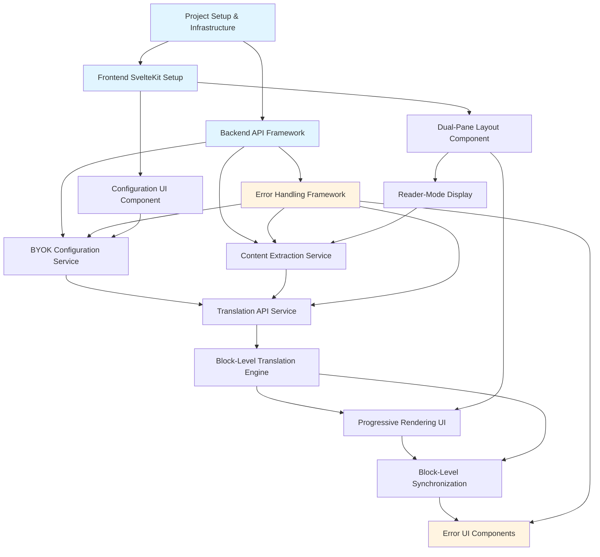
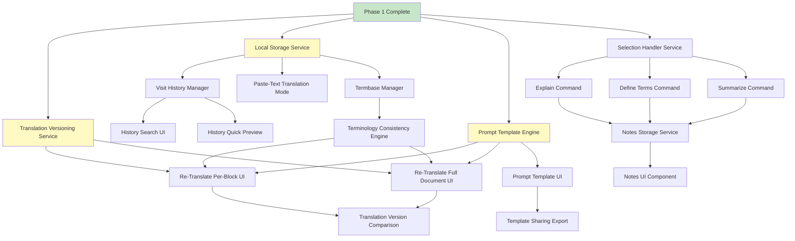
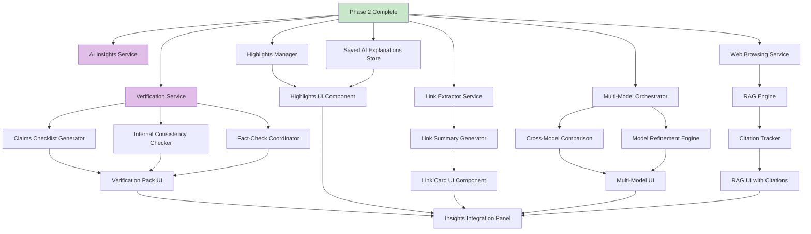
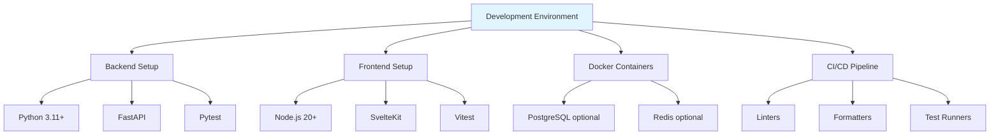

# Feature Dependency Analysis for Luminote

This document provides a comprehensive dependency graph for all features across
Phase 1, Phase 2, and Phase 3 of Luminote development, following the methodology
outlined in
[github-issue-creation-methodology.md](github-issue-creation-methodology.md).

## Table of Contents

- [Phase 1: Core Translation Workbench Dependencies](#phase-1-core-translation-workbench-dependencies)
- [Phase 2: Translation Refinement & User Knowledge Dependencies](#phase-2-translation-refinement--user-knowledge-dependencies)
- [Phase 3: AI Insights & Verification Dependencies](#phase-3-ai-insights--verification-dependencies)
- [Cross-Phase Dependencies](#cross-phase-dependencies)
- [Infrastructure Dependencies](#infrastructure-dependencies)
- [Implementation Batches](#implementation-batches)

______________________________________________________________________

## Phase 1: Core Translation Workbench Dependencies

### Dependency Graph

### Feature Breakdown

#### 1. Infrastructure & Foundation (Must Complete First)

- **A: Project Setup & Infrastructure**

  - Python/FastAPI backend structure
  - SvelteKit frontend structure
  - Docker containers for local development
  - CI/CD pipeline setup
  - Pre-commit hooks (linting, formatting)
  - Development environment documentation

- **B: Backend API Framework**

  - FastAPI application skeleton
  - API versioning structure (`/api/v1/`)
  - Logging configuration
  - CORS setup for frontend integration
  - Health check endpoint
  - Basic request/response models

- **C: Frontend SvelteKit Setup**

  - SvelteKit project initialization
  - Routing structure
  - TypeScript configuration
  - Component library setup (UI primitives)
  - State management foundation
  - API client setup (fetch utilities)

#### 2. Core Services Layer (Parallel After Infrastructure)

- **D: BYOK Configuration Service**

  - **Depends on:** B (Backend API Framework)
  - **Blocks:** F (Translation API Service)
  - Configuration storage (browser-side)
  - Provider abstraction (OpenAI, Anthropic, etc.)
  - API key validation endpoint
  - Target language selection
  - Model selection per provider

- **E: Content Extraction Service**

  - **Depends on:** B (Backend API Framework), G (Error Handling Framework)
  - **Blocks:** F (Translation API Service), J (Reader-Mode Display)
  - Mozilla Readability integration
  - Content fetching with user-agent handling
  - HTML parsing and cleaning
  - Block structure generation (paragraphs, headings, lists, etc.)
  - Metadata extraction (title, author, date)

- **G: Error Handling Framework**

  - **Depends on:** B (Backend API Framework)
  - **Blocks:** D, E, F (All services need error handling)
  - Custom exception classes
  - Error response models
  - HTTP status code mapping
  - Error logging and tracking
  - User-friendly error messages

#### 3. Translation & Rendering Layer

- **F: Translation API Service**

  - **Depends on:** D (BYOK Config), E (Content Extraction), G (Error Handling)
  - **Blocks:** K (Block-Level Translation Engine)
  - Provider API client implementations
  - Translation request/response handling
  - Rate limiting client-side
  - Retry logic with exponential backoff
  - Token usage tracking

- **K: Block-Level Translation Engine**

  - **Depends on:** F (Translation API Service)
  - **Blocks:** L (Progressive Rendering UI)
  - Block-level translation coordination
  - Streaming translation support (SSE or WebSockets)
  - Translation queue management
  - Block mapping (source ↔ translation)
  - Context window management

#### 4. UI Components Layer

- **H: Dual-Pane Layout Component**

  - **Depends on:** C (Frontend Setup)
  - **Blocks:** J (Reader-Mode Display), L (Progressive Rendering)
  - Two-column responsive layout
  - Draggable divider for pane resizing
  - Pane width persistence (localStorage)
  - Mobile stacked layout
  - Keyboard navigation between panes

- **I: Configuration UI Component**

  - **Depends on:** C (Frontend Setup)
  - **Blocks:** D (BYOK Configuration Service)
  - Settings modal/panel
  - Provider selection dropdown
  - API key input with validation
  - Language selection
  - Model selection
  - Test connection button

- **J: Reader-Mode Display**

  - **Depends on:** H (Dual-Pane Layout), E (Content Extraction)
  - **Blocks:** L (Progressive Rendering UI)
  - Source content rendering
  - Heading hierarchy visualization
  - Code block syntax highlighting
  - Image display with lazy loading
  - List and quote formatting

- **L: Progressive Rendering UI**

  - **Depends on:** H (Dual-Pane Layout), K (Block-Level Translation)
  - **Blocks:** M (Block-Level Synchronization)
  - Skeleton loading states
  - Progressive block rendering
  - Scroll position management
  - Loading indicators per block
  - Streaming text display

#### 5. Advanced Features Layer

- **M: Block-Level Synchronization**

  - **Depends on:** L (Progressive Rendering), K (Block-Level Translation)
  - Hover linkage between panes
  - Click-to-jump navigation
  - Block highlighting
  - Scroll synchronization
  - Touch support for mobile
  - Keyboard shortcuts

- **N: Error UI Components**

  - **Depends on:** G (Error Handling Framework), M (Synchronization complete)
  - Toast notifications
  - Error modals
  - Inline error warnings
  - Retry buttons with countdown
  - Debug mode toggle
  - Error report generation

### Phase 1 Implementation Batches

**Batch 1: Foundation (Week 1)**

- A: Project Setup & Infrastructure
- B: Backend API Framework
- C: Frontend SvelteKit Setup

**Batch 2: Core Services (Week 2)**

- G: Error Handling Framework
- D: BYOK Configuration Service
- E: Content Extraction Service

**Batch 3: Translation Engine (Week 3)**

- F: Translation API Service
- K: Block-Level Translation Engine

**Batch 4: UI Components (Week 4)**

- H: Dual-Pane Layout Component
- I: Configuration UI Component
- J: Reader-Mode Display

**Batch 5: Integration (Week 5)**

- L: Progressive Rendering UI
- M: Block-Level Synchronization

**Batch 6: Polish & Testing (Week 6)**

- N: Error UI Components
- Integration testing
- Documentation

______________________________________________________________________

## Phase 2: Translation Refinement & User Knowledge Dependencies

### Dependency Graph

### Feature Breakdown

#### 6. Storage & Versioning Foundation

- **O: Translation Versioning Service**

  - **Depends on:** Phase 1 Complete
  - **Blocks:** R (Re-Translate Per-Block), S (Re-Translate Full Document)
  - Version storage in IndexedDB
  - Version metadata (timestamp, model, prompt)
  - Version comparison logic
  - Rollback functionality
  - Version pruning (keep N most recent)

- **P: Local Storage Service**

  - **Depends on:** Phase 1 Complete
  - **Blocks:** U (Visit History), V (Paste-Text Mode), AC (Notes Storage), AD
    (Termbase)
  - IndexedDB abstraction layer
  - Encryption for sensitive data (optional)
  - Storage quota management
  - Import/export utilities
  - Data migration support

- **Q: Prompt Template Engine**

  - **Depends on:** Phase 1 Complete
  - **Blocks:** R, S (Re-translation features), AE (Template UI)
  - Template parsing and variable substitution
  - Built-in template library
  - Custom template validation
  - Context injection (surrounding blocks)
  - System instruction handling

#### 7. Re-Translation Features

- **R: Re-Translate Per-Block UI**

  - **Depends on:** O (Versioning), Q (Template Engine)
  - **Blocks:** T (Version Comparison)
  - Block context menu with "Re-translate" option
  - Custom prompt input modal
  - Model selection override
  - Preview before applying
  - Keep/reject decision UI

- **S: Re-Translate Full Document UI**

  - **Depends on:** O (Versioning), Q (Template Engine)
  - **Blocks:** T (Version Comparison)
  - Full document re-translation trigger
  - Batch mode options
  - Progress indicator
  - Cancel mid-process
  - Apply all/partial results

- **T: Translation Version Comparison**

  - **Depends on:** R (Re-Translate Block), S (Re-Translate Document)
  - Side-by-side version diff
  - Version selector dropdown
  - Highlight changes
  - Restore previous version button
  - Version metadata display

#### 8. History & Paste Features

- **U: Visit History Manager**

  - **Depends on:** P (Local Storage Service)
  - **Blocks:** W (History Search UI), X (History Quick Preview)
  - Visit record creation on each translation
  - Metadata capture (URL, title, date, language pair)
  - Content caching with compression
  - Automatic cleanup of old entries
  - Export history as JSON

- **V: Paste-Text Translation Mode**

  - **Depends on:** P (Local Storage Service)
  - Fallback mode for non-extractable content
  - Text input interface
  - Language detection
  - Direct translation without extraction
  - Save as temporary session
  - Convert to saved history entry

- **W: History Search UI**

  - **Depends on:** U (Visit History Manager)
  - Search by URL, title, date range
  - Filter by language pair
  - Sort by date/frequency
  - Bulk delete/export
  - Quick preview on hover

- **X: History Quick Preview**

  - **Depends on:** U (Visit History Manager)
  - Thumbnail/excerpt preview
  - Metadata tooltip
  - One-click re-open
  - Compare with current content
  - Mark as favorite/archive

#### 9. Selection Commands & Notes

- **Y: Selection Handler Service**

  - **Depends on:** Phase 1 Complete
  - **Blocks:** Z (Explain), AA (Define), AB (Summarize)
  - Text selection detection (source and translation panes)
  - Context menu integration
  - Selection context capture
  - Multi-pane selection support

- **Z: Explain Command**

  - **Depends on:** Y (Selection Handler)
  - **Blocks:** AC (Notes Storage)
  - "Explain this" on selected text
  - Context-aware explanation (surrounding blocks)
  - Save explanation as note
  - Inline display or modal

- **AA: Define Terms Command**

  - **Depends on:** Y (Selection Handler)
  - **Blocks:** AC (Notes Storage)
  - "Define terms" on selected text
  - Bilingual term definitions
  - Add to termbase option
  - Show related terms

- **AB: Summarize Command**

  - **Depends on:** Y (Selection Handler)
  - **Blocks:** AC (Notes Storage)
  - "Summarize this" on selected text
  - Adjustable summary length
  - Save as note
  - Copy to clipboard

- **AC: Notes Storage Service**

  - **Depends on:** Z, AA, AB (Selection commands), P (Local Storage)
  - **Blocks:** AG (Notes UI)
  - Note creation and management
  - Anchoring notes to blocks
  - Note categorization (explanation, definition, summary)
  - Search and filter notes
  - Export notes as Markdown

- **AG: Notes UI Component**

  - **Depends on:** AC (Notes Storage)
  - Notes sidebar/panel
  - Note list with search
  - Note editor
  - Link to source block
  - Note sharing/export

#### 10. Termbase & Templates

- **AD: Termbase Manager**

  - **Depends on:** P (Local Storage Service)
  - **Blocks:** AF (Terminology Consistency)
  - Term entry creation (source + target)
  - Term categories/tags
  - Import/export termbase (TBX, CSV)
  - Search and filter terms
  - Term usage tracking

- **AE: Prompt Template UI**

  - **Depends on:** Q (Template Engine)
  - **Blocks:** AH (Template Sharing)
  - Template library browser
  - Template editor
  - Variable preview
  - Template testing
  - Favorite templates

- **AF: Terminology Consistency Engine**

  - **Depends on:** AD (Termbase Manager)
  - **Blocks:** R, S (Re-translation features)
  - Inject termbase into prompts
  - Term consistency checking
  - Suggest term usage
  - Highlight term matches

- **AH: Template Sharing Export**

  - **Depends on:** AE (Template UI)
  - Export templates as JSON
  - Import shared templates
  - Template marketplace integration (future)

### Phase 2 Implementation Batches

**Batch 1: Storage Foundation (Week 7)**

- P: Local Storage Service
- O: Translation Versioning Service
- Q: Prompt Template Engine

**Batch 2: Re-Translation (Week 8)**

- R: Re-Translate Per-Block UI
- S: Re-Translate Full Document UI
- T: Translation Version Comparison

**Batch 3: History & Paste (Week 9)**

- U: Visit History Manager
- V: Paste-Text Translation Mode
- W: History Search UI
- X: History Quick Preview

**Batch 4: Selection Commands (Week 10)**

- Y: Selection Handler Service
- Z: Explain Command
- AA: Define Terms Command
- AB: Summarize Command

**Batch 5: Notes & Knowledge (Week 11)**

- AC: Notes Storage Service
- AG: Notes UI Component
- AD: Termbase Manager
- AE: Prompt Template UI

**Batch 6: Advanced Features (Week 12)**

- AF: Terminology Consistency Engine
- AH: Template Sharing Export
- Integration testing

______________________________________________________________________

## Phase 3: AI Insights & Verification Dependencies

### Dependency Graph

### Feature Breakdown

#### 11. AI Insights Foundation

- **AI: AI Insights Service**

  - **Depends on:** Phase 2 Complete
  - **Blocks:** VC, IC, FC (Verification features)
  - On-demand insight generation
  - Context-aware prompting
  - Insight categorization
  - Insight caching
  - Cost tracking per insight

- **VER: Verification Service**

  - **Depends on:** Phase 2 Complete
  - **Blocks:** VC (Claims Checklist), IC (Consistency Checker), FC (Fact-Check)
  - Verification request orchestration
  - Verification result storage
  - Verification confidence scoring
  - Verification history tracking

#### 12. Verification Features

- **VC: Claims Checklist Generator**

  - **Depends on:** VER (Verification Service)
  - **Blocks:** VP (Verification Pack UI)
  - Extract verifiable claims from content
  - Generate checklist format
  - Claim categorization (factual, opinion, statistical)
  - Source link extraction

- **IC: Internal Consistency Checker**

  - **Depends on:** VER (Verification Service)
  - **Blocks:** VP (Verification Pack UI)
  - Check for contradictions within content
  - Identify ambiguous statements
  - Cross-reference claims
  - Generate consistency report

- **FC: Fact-Check Coordinator**

  - **Depends on:** VER (Verification Service)
  - **Blocks:** VP (Verification Pack UI)
  - Coordinate external fact-checking (optional web search)
  - Compare claims to knowledge cutoff date
  - Generate fact-check summary
  - Confidence level per claim

- **VP: Verification Pack UI**

  - **Depends on:** VC, IC, FC (All verification features)
  - **Blocks:** INT (Integration Panel)
  - Display verification results
  - Interactive claims checklist
  - Consistency report viewer
  - Fact-check summary
  - Export verification report

#### 13. Highlights & Saved Explanations

- **HL: Highlights Manager**

  - **Depends on:** Phase 2 Complete
  - **Blocks:** HUI (Highlights UI)
  - Create highlights on source or translation
  - Highlight colors/categories
  - Highlight annotations
  - Search highlights
  - Export highlights

- **SAI: Saved AI Explanations Store**

  - **Depends on:** Phase 2 Complete
  - **Blocks:** HUI (Highlights UI)
  - Store AI-generated explanations
  - Link explanations to blocks
  - Explanation versioning
  - Search explanations
  - Export explanations

- **HUI: Highlights UI Component**

  - **Depends on:** HL (Highlights Manager), SAI (Saved Explanations)
  - **Blocks:** INT (Integration Panel)
  - Highlight creation interface
  - Color picker
  - Annotation editor
  - Highlights list sidebar
  - Jump to highlighted section

#### 14. Link Cards

- **LC: Link Extractor Service**

  - **Depends on:** Phase 2 Complete
  - **Blocks:** LS (Link Summary Generator)
  - Extract links from content
  - Link metadata extraction
  - Link categorization (internal, external, reference)
  - Link validation

- **LS: Link Summary Generator**

  - **Depends on:** LC (Link Extractor)
  - **Blocks:** LUI (Link Card UI)
  - Generate bilingual summaries for links
  - Link content preview
  - Relevance scoring
  - Summary caching

- **LUI: Link Card UI Component**

  - **Depends on:** LS (Link Summary Generator)
  - **Blocks:** INT (Integration Panel)
  - Display link cards in sidebar
  - Bilingual summary display
  - Click-to-open link
  - Summary expansion
  - Card filtering/sorting

#### 15. Multi-Model Features

- **MM: Multi-Model Orchestrator**

  - **Depends on:** Phase 2 Complete
  - **Blocks:** MC (Cross-Model Comparison), MR (Model Refinement)
  - Manage multiple provider/model configurations
  - Parallel translation requests
  - Cost optimization
  - Fallback chain management

- **MC: Cross-Model Comparison**

  - **Depends on:** MM (Multi-Model Orchestrator)
  - **Blocks:** MUI (Multi-Model UI)
  - Request translations from multiple models
  - Side-by-side comparison
  - Difference highlighting
  - Quality scoring (if metrics available)

- **MR: Model Refinement Engine**

  - **Depends on:** MM (Multi-Model Orchestrator)
  - **Blocks:** MUI (Multi-Model UI)
  - Use one model to critique another's translation
  - Iterative refinement workflow
  - Refinement history tracking
  - Best result selection

- **MUI: Multi-Model UI**

  - **Depends on:** MC (Cross-Model Comparison), MR (Model Refinement)
  - **Blocks:** INT (Integration Panel)
  - Model selector for comparison
  - Comparison view
  - Refinement controls
  - Model performance metrics
  - Cost tracker

#### 16. Web Browsing & RAG

- **WB: Web Browsing Service**

  - **Depends on:** Phase 2 Complete
  - **Blocks:** RAG (RAG Engine)
  - Web search integration (optional)
  - Search result extraction
  - Result ranking
  - Snippet extraction
  - Rate limiting

- **RAG: RAG Engine**

  - **Depends on:** WB (Web Browsing Service)
  - **Blocks:** CIT (Citation Tracker)
  - Query generation from content
  - Retrieve relevant documents
  - Context augmentation for prompts
  - Relevance scoring
  - Result deduplication

- **CIT: Citation Tracker**

  - **Depends on:** RAG (RAG Engine)
  - **Blocks:** RAGUI (RAG UI with Citations)
  - Track sources used in RAG
  - Citation formatting
  - Source credibility scoring
  - Citation export

- **RAGUI: RAG UI with Citations**

  - **Depends on:** CIT (Citation Tracker)
  - **Blocks:** INT (Integration Panel)
  - Display RAG-enhanced results
  - Show citations inline
  - Citation panel
  - Source links
  - Citation export

#### 17. Integration

- **INT: Insights Integration Panel**
  - **Depends on:** VP, HUI, LUI, MUI, RAGUI (All Phase 3 UI components)
  - Unified insights sidebar
  - Tab/section navigation
  - Context-aware insights
  - Insights export
  - Settings for AI features

### Phase 3 Implementation Batches

**Batch 1: Verification Foundation (Week 13)**

- AI: AI Insights Service
- VER: Verification Service

**Batch 2: Verification Features (Week 14)**

- VC: Claims Checklist Generator
- IC: Internal Consistency Checker
- FC: Fact-Check Coordinator
- VP: Verification Pack UI

**Batch 3: Highlights & Knowledge (Week 15)**

- HL: Highlights Manager
- SAI: Saved AI Explanations Store
- HUI: Highlights UI Component

**Batch 4: Link Intelligence (Week 16)**

- LC: Link Extractor Service
- LS: Link Summary Generator
- LUI: Link Card UI Component

**Batch 5: Multi-Model Features (Week 17)**

- MM: Multi-Model Orchestrator
- MC: Cross-Model Comparison
- MR: Model Refinement Engine
- MUI: Multi-Model UI

**Batch 6: Web Browsing & RAG (Week 18)**

- WB: Web Browsing Service
- RAG: RAG Engine
- CIT: Citation Tracker
- RAGUI: RAG UI with Citations

**Batch 7: Integration & Polish (Week 19)**

- INT: Insights Integration Panel
- End-to-end testing
- Performance optimization

______________________________________________________________________

## Cross-Phase Dependencies

### Critical Path Analysis

### Blocking Dependencies

**Phase 1 Blockers (Cannot Start Phase 2 Until Complete):**

- Dual-pane layout with progressive rendering
- Block-level translation and synchronization
- BYOK configuration working end-to-end
- Error handling framework operational

**Phase 2 Blockers (Cannot Start Phase 3 Until Complete):**

- Translation versioning functional
- Local storage service reliable
- Selection commands and notes working
- History management operational

**Phase 3 Blockers (Cannot Release Until Complete):**

- Verification service producing accurate results
- Highlights and saved explanations stable
- Multi-model features tested across providers
- Performance acceptable with all features enabled

______________________________________________________________________

## Infrastructure Dependencies

### Development Environment

### Infrastructure Requirements by Phase

**Phase 1:**

- Backend: FastAPI, Readability, httpx, pydantic
- Frontend: SvelteKit, TypeScript, Tailwind CSS
- Storage: Browser localStorage/IndexedDB
- Testing: Pytest, Vitest
- CI/CD: GitHub Actions (lint, test, build)

**Phase 2:**

- Additional: IndexedDB wrapper, compression library
- Testing: Integration tests, E2E tests (Playwright)

**Phase 3:**

- Additional: Multiple provider SDKs, web search API (optional)
- Performance: Caching layer, CDN (for deployment)
- Monitoring: Error tracking, usage analytics

______________________________________________________________________

## Implementation Batches

### Sequential Implementation Order

| Batch | Phase | Duration | Features                                        | Prerequisites |
| ----- | ----- | -------- | ----------------------------------------------- | ------------- |
| 1     | 1     | Week 1   | Project Setup, Backend/Frontend Scaffolding     | None          |
| 2     | 1     | Week 2   | Error Handling, BYOK Config, Content Extraction | Batch 1       |
| 3     | 1     | Week 3   | Translation Service, Block Engine               | Batch 2       |
| 4     | 1     | Week 4   | Dual-Pane Layout, Config UI, Reader Display     | Batch 1       |
| 5     | 1     | Week 5   | Progressive Rendering, Block Sync               | Batch 3, 4    |
| 6     | 1     | Week 6   | Error UI, Testing, Documentation                | Batch 5       |
| 7     | 2     | Week 7   | Storage Service, Versioning, Templates          | Phase 1       |
| 8     | 2     | Week 8   | Re-Translation Features                         | Batch 7       |
| 9     | 2     | Week 9   | History & Paste Mode                            | Batch 7       |
| 10    | 2     | Week 10  | Selection Commands                              | Phase 1       |
| 11    | 2     | Week 11  | Notes & Termbase                                | Batch 10      |
| 12    | 2     | Week 12  | Consistency Engine, Testing                     | Batch 11      |
| 13    | 3     | Week 13  | AI Insights, Verification Service               | Phase 2       |
| 14    | 3     | Week 14  | Verification Features                           | Batch 13      |
| 15    | 3     | Week 15  | Highlights & Saved Explanations                 | Phase 2       |
| 16    | 3     | Week 16  | Link Intelligence                               | Phase 2       |
| 17    | 3     | Week 17  | Multi-Model Features                            | Batch 13      |
| 18    | 3     | Week 18  | Web Browsing & RAG                              | Batch 13      |
| 19    | 3     | Week 19  | Integration & Polish                            | All Batches   |

### Parallel Work Opportunities

**Can Work in Parallel:**

- Backend services + Frontend components (after infrastructure)
- Error handling + Feature implementation
- Testing + Documentation (as features complete)
- UI polish + Performance optimization

**Cannot Parallelize:**

- Infrastructure must complete before features
- Core services before UI components that depend on them
- Phase N must complete before Phase N+1
- Critical path items (see Critical Path Analysis above)

______________________________________________________________________

## Summary

This dependency analysis provides:

1. **Visual Dependency Graphs** for each phase showing what blocks what
1. **Feature Breakdowns** with explicit dependencies and blocked items
1. **Implementation Batches** organized by week and prerequisites
1. **Cross-Phase Dependencies** showing the critical path
1. **Infrastructure Requirements** needed at each stage
1. **Parallel Work Opportunities** to maximize development velocity

**Next Steps:**

1. Review and validate dependency mappings
1. Create ADRs for key architectural decisions (see
   [github-issue-creation-methodology.md](github-issue-creation-methodology.md)
   Step 1.3)
1. Begin decomposing features into atomic issues (methodology Step 2.1)
1. Set up GitHub milestones and labels (methodology Step 3.2)
1. Create first batch of issues for Phase 1 infrastructure

**Deliverable:** This document serves as the foundation for creating GitHub
Copilot-ready issues following the methodology in
[github-issue-creation-methodology.md](github-issue-creation-methodology.md).
